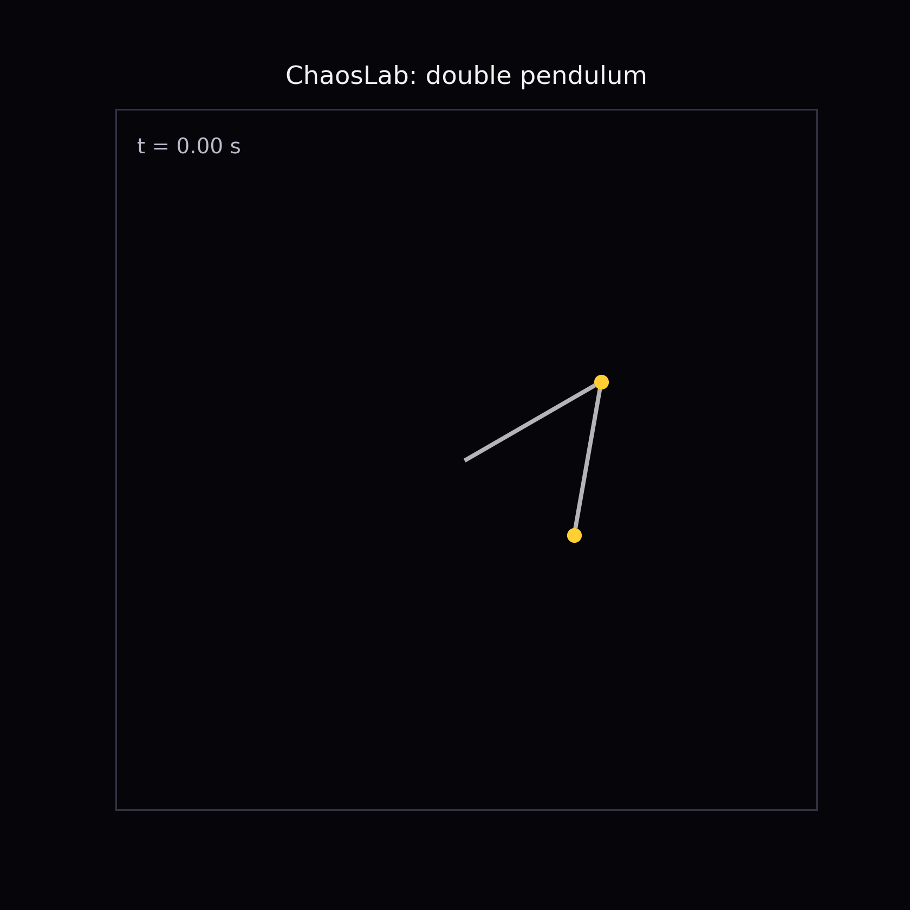
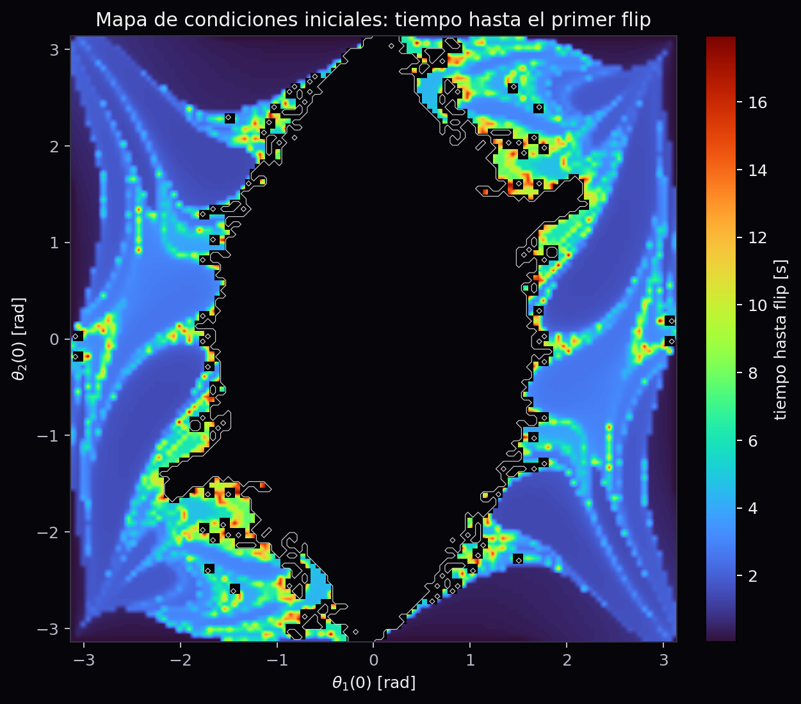
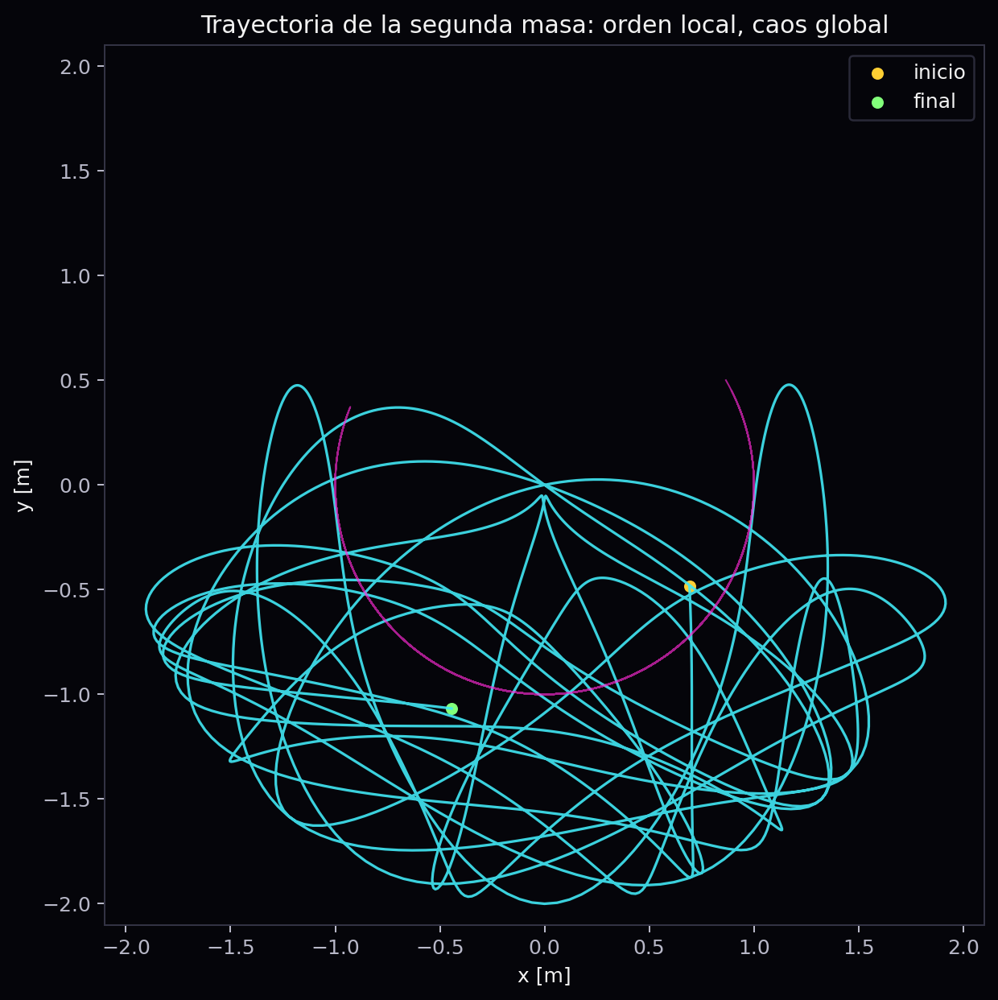
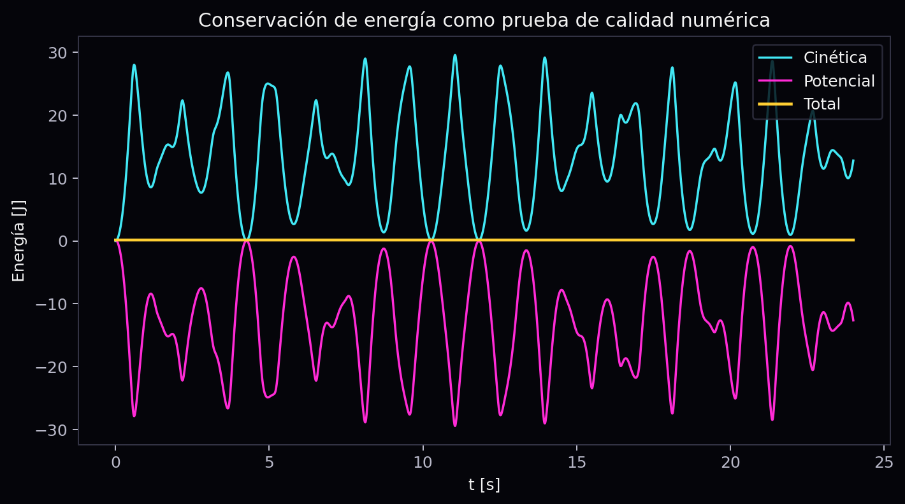

# ChaosLab: Double Pendulum as Classical Chaos

ChaosLab is a computational physics project about the double pendulum. It uses
numerical integration, energy checks, phase-space trajectories, flip-time maps,
and animated presentation assets to show how a deterministic mechanical system
can become practically unpredictable.

The project was built for a Physics I final presentation, but the repository is
organized as a reproducible simulation and visualization package rather than a
one-off slide deck.

## Visual Preview

<p align="center">
  
</p>

| Flip-time map | Mass trajectory | Energy conservation |
| --- | --- | --- |
|  |  |  |

Video and presentation assets:

- [`animations/chaoslab_teaser.mp4`](animations/chaoslab_teaser.mp4): short visual teaser.
- [`animations/chaoslab_pitch_5min.mp4`](animations/chaoslab_pitch_5min.mp4): five-minute rendered pitch.
- [`presentation/index.html`](presentation/index.html): animated browser presentation for live explanation.

## Core Question

How does predictability change when a simple pendulum becomes a double
pendulum, and how can that loss of predictability be made visible through
simulation?

The repository answers this through three checks:

- energy conservation, to make sure the numerical solution is physically
  credible;
- trajectory divergence, to show sensitivity to initial conditions;
- flip-time maps, to expose the structure of the initial-condition space.

## What Is Included

- Double-pendulum equations of motion integrated with `scipy.integrate.solve_ivp`.
- Kinetic, potential, and total-energy computation.
- Divergence analysis for trajectories separated by a tiny initial
  perturbation.
- A vectorized flip-time map over initial angles.
- A Streamlit app for interactive exploration.
- Publication-ready figures, GIFs, and MP4 renders.
- An HTML presentation with synchronized visual narrative.
- Optional geometric animation support through Matplotlib and Manim.

## Setup

```bash
python -m venv .venv
source .venv/bin/activate  # Windows: .venv\Scripts\activate
pip install -r requirements.txt
```

System dependencies for optional exports:

```bash
ffmpeg -version
latexmk -v
pdflatex --version
```

FFmpeg is required for MP4 generation. A LaTeX distribution is required only if
you want to rebuild `report/informe_final.pdf`.

## Generate Assets

```bash
python scripts/generate_assets.py
```

Generated outputs are written to:

```text
figures/
animations/
data/
```

## Run the App

```bash
streamlit run app.py
```

## Run the Presentation

First export the compact data used by the browser presentation:

```bash
python scripts/export_presentation_data.py
```

Then open:

```text
presentation/index.html
```

Presentation controls:

- right arrow or space: next slide;
- left arrow: previous slide;
- `N`: toggle presenter notes.

## Verification

```bash
python scripts/smoke_test.py
```

The smoke test checks numerical stability, energy drift, trajectory divergence,
and video-tool availability.

## Final Artifacts

```text
report/latex/informe_final.tex
report/latex/references.bib
report/informe_final.md
report/informe_final.pdf
slides/presentacion_final.pdf
slides/guion_5_min.md
animations/chaoslab_pitch_5min.mp4
presentation/index.html
```

## Repository Layout

```text
src/chaoslab/physics.py   Equations of motion, energy, divergence
src/chaoslab/fractal.py   Vectorized flip-time map
src/chaoslab/visuals.py   Figures and animations
scripts/generate_assets.py
scripts/render_pitch_video.py
scripts/build_documents.py
scripts/export_presentation_data.py
scripts/smoke_test.py
app.py
docs/propuesta.md
slides/guion_5_min.md
report/latex/informe_final.tex
report/informe_final.md
presentation/index.html
```

## Main Observations

1. The second mass traces complex paths while total energy remains nearly
   conserved.
2. Two trajectories separated by `1e-6 rad` diverge rapidly.
3. The flip-time map has sharp boundaries: small changes in initial conditions
   can change whether and when the pendulum completes a flip.

## Scope

The project focuses on classical mechanics and numerical visualization. Machine
learning is not part of the core claim; the physical system already provides a
clear setting for nonlinear dynamics, conservation laws, and sensitivity to
initial conditions.
