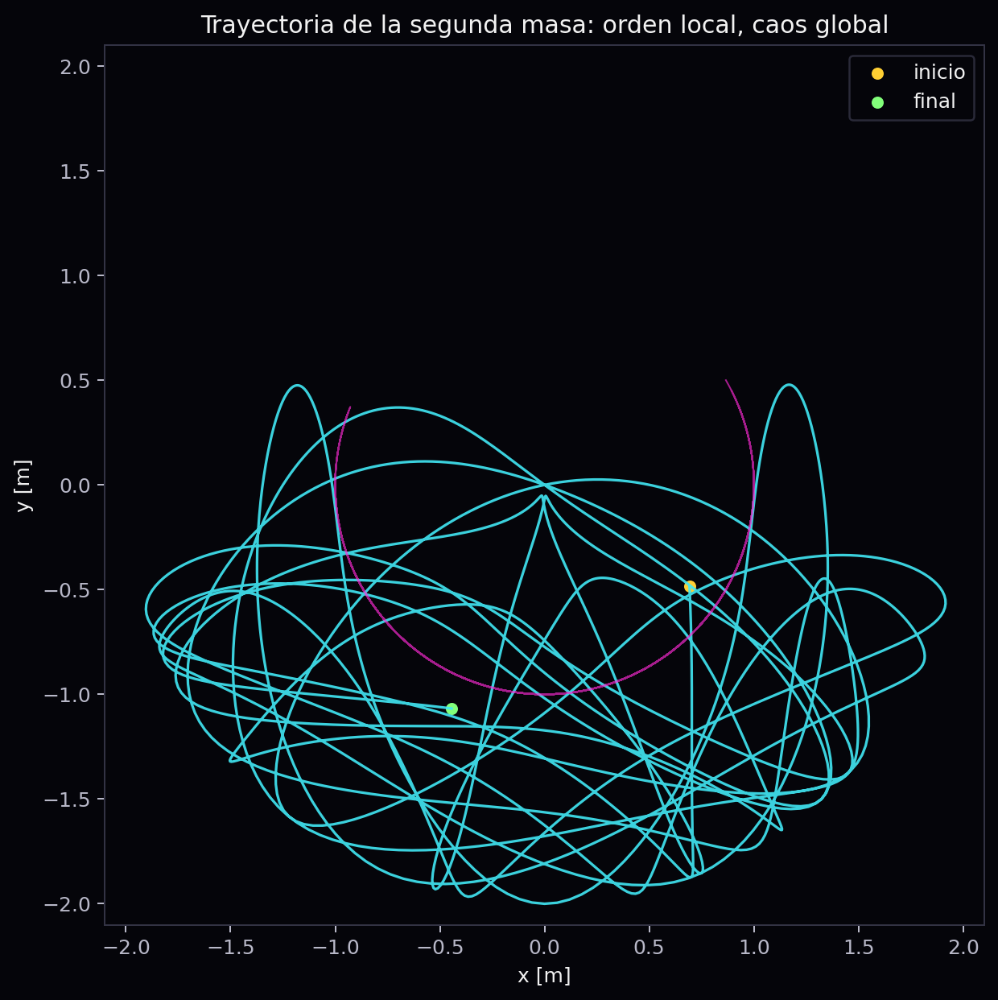
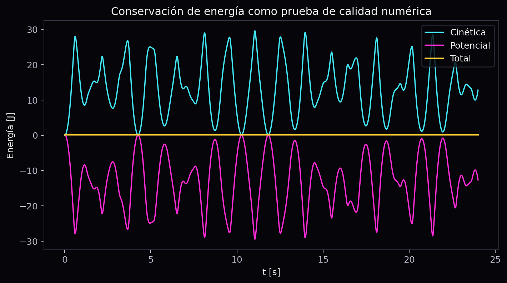
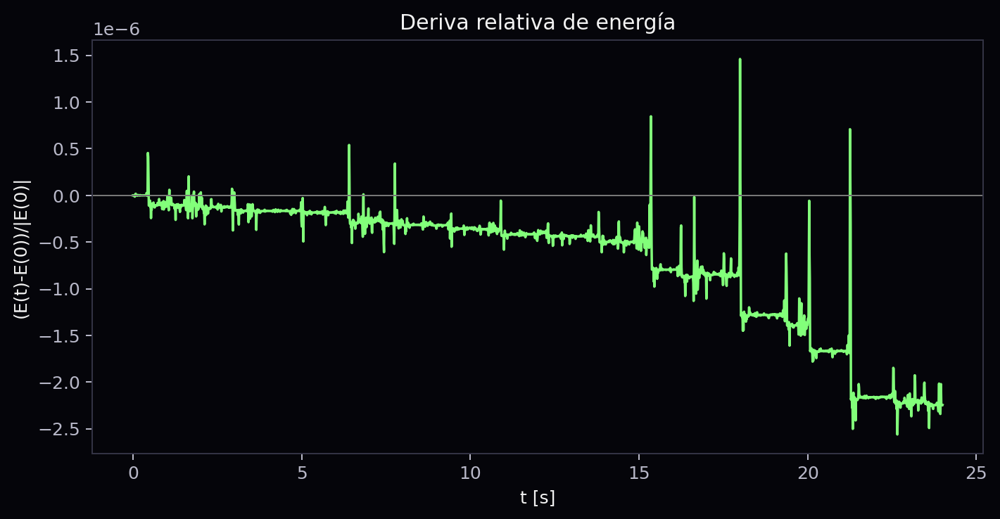
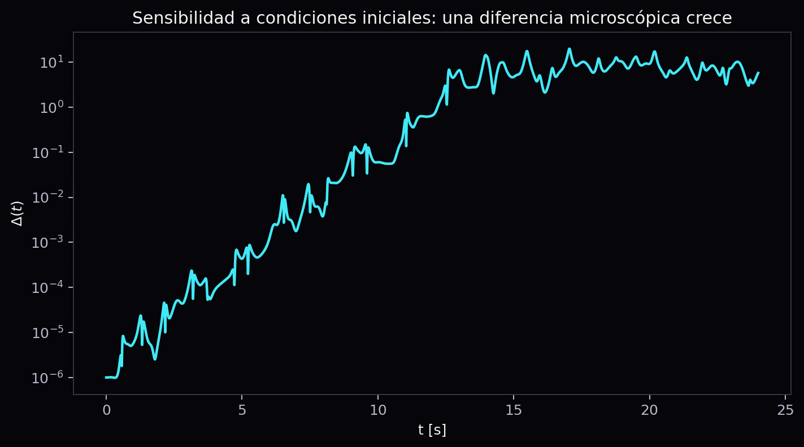
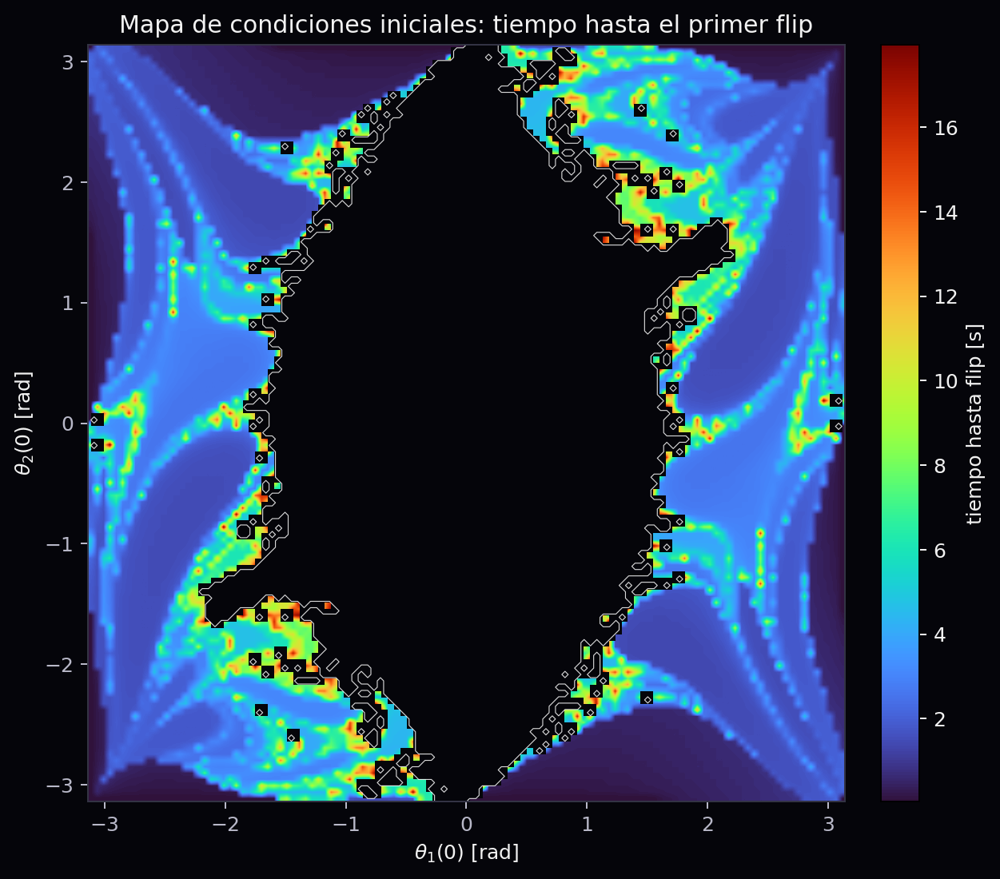

# ChaosLab: simulacion y analisis del pendulo doble como sistema caotico de mecanica clasica

**Curso:** Fisica I  
**Profesor:** Jose Augusto Galvis  
**Proyecto final:** simulacion computacional reproducible  
**Fecha de socializacion:** viernes 29 de mayo, 11:00 a.m. a 1:00 p.m.

## Resumen

Este proyecto desarrolla una simulacion computacional del pendulo doble para estudiar como un sistema mecanico clasico puede pasar de un comportamiento regular a uno practicamente impredecible. El sistema se modela con dos coordenadas angulares, sus velocidades angulares y un conjunto de ecuaciones diferenciales ordinarias acopladas. La simulacion se resuelve numericamente con `solve_ivp` de SciPy y se analizan cuatro evidencias: trayectorias de las masas, conservacion de energia mecanica, divergencia entre condiciones iniciales casi identicas y un mapa de condiciones iniciales donde cada pixel representa un experimento numerico.

El resultado principal es que dos trayectorias separadas inicialmente por una perturbacion de `1e-6 rad` pueden divergir de forma visible mientras la energia total se conserva con una deriva relativa pequena. Por tanto, la perdida de predictibilidad no se interpreta como ausencia de leyes fisicas ni como error numerico dominante, sino como consecuencia de la dinamica no lineal del sistema.

## Introduccion

El pendulo simple es uno de los modelos mas conocidos de Fisica I: una masa suspendida oscila bajo la accion de la gravedad y, para angulos pequenos, su movimiento puede aproximarse como armonico simple. Esta aproximacion conecta directamente con conceptos del curso: posicion angular, velocidad, aceleracion, fuerza gravitacional, energia potencial, energia cinetica y conservacion de energia.

El pendulo doble se obtiene al agregar una segunda masa acoplada a la primera. La modificacion parece pequena, pero cambia profundamente el comportamiento del sistema. Ahora el estado requiere dos angulos y dos velocidades angulares. Las ecuaciones de movimiento dejan de ser lineales en general, la energia se intercambia entre dos grados de libertad y pequenas diferencias en las condiciones iniciales pueden amplificarse con rapidez.

La pregunta del proyecto es: **como cambia la predictibilidad de un sistema mecanico al pasar de un pendulo simple a un pendulo doble, y como se evidencia esa sensibilidad mediante simulacion numerica, conservacion de energia y mapas de condiciones iniciales?**

## Objetivos

### Objetivo general

Desarrollar una simulacion computacional reproducible del pendulo doble, conectando mecanica clasica, calculo, ecuaciones diferenciales y visualizacion cientifica para analizar energia, trayectorias, divergencia y estructura en el espacio de condiciones iniciales.

### Objetivos especificos

1. Implementar el modelo dinamico del pendulo doble como un sistema de ecuaciones diferenciales ordinarias.
2. Resolver el sistema numericamente y verificar la conservacion aproximada de la energia mecanica.
3. Comparar dos trayectorias con condiciones iniciales casi identicas para evidenciar sensibilidad a condiciones iniciales.
4. Construir un mapa de condiciones iniciales que indique el tiempo hasta el primer giro completo.
5. Preparar una demo interactiva y una presentacion visual de menos de cinco minutos.

## Materiales y herramientas

- Python 3.
- NumPy para calculo numerico.
- SciPy para resolver ecuaciones diferenciales con `solve_ivp`.
- Matplotlib para graficas, animaciones y video.
- Pillow para exportar GIF.
- Streamlit para la demo interactiva.
- ReportLab para generar los PDF finales.
- FFmpeg para exportar video MP4.

## Marco teorico

### Pendulo simple y aproximacion de angulo pequeno

En un pendulo simple, el angulo `theta` describe la posicion de la masa respecto a la vertical. La velocidad angular es la derivada del angulo:

```text
omega = d theta / dt
```

y la aceleracion angular es la segunda derivada:

```text
alpha = d^2 theta / dt^2
```

Para angulos pequenos se usa la aproximacion de Taylor:

```text
sin(theta) ~= theta
```

Con esta aproximacion el sistema se vuelve lineal y aparece un movimiento aproximadamente periodico. En el pendulo doble, esa simplificacion deja de ser suficiente cuando los angulos son grandes y las dos masas intercambian energia.

### Estado del pendulo doble

El estado de la simulacion se define como:

```text
s(t) = [theta1, omega1, theta2, omega2]
```

donde `theta1` y `theta2` son los angulos de las dos barras, y `omega1`, `omega2` son sus velocidades angulares. El sistema se resuelve como un problema de valor inicial: dado el estado en `t = 0`, el integrador calcula la evolucion del sistema.

### Energia mecanica

La energia total se calcula como:

```text
E = T + V
```

donde `T` es energia cinetica y `V` es energia potencial gravitacional. En el modelo ideal sin rozamiento, la energia total debe conservarse. Por eso se usa la deriva relativa de energia como prueba de calidad numerica:

```text
(E(t) - E(0)) / |E(0)|
```

### Sensibilidad a condiciones iniciales

Para medir sensibilidad se simulan dos sistemas con condiciones iniciales casi identicas. La segunda simulacion cambia solo:

```text
theta2'(0) = theta2(0) + 1e-6 rad
```

Luego se calcula una distancia de fase:

```text
Delta(t) = sqrt((theta1 - theta1')^2 + (theta2 - theta2')^2 + (omega1 - omega1')^2 + (omega2 - omega2')^2)
```

Si `Delta(t)` crece rapidamente en una grafica semilogaritmica, hay evidencia de sensibilidad a condiciones iniciales. En este informe se reporta la pendiente temprana de `log(Delta(t))` como indicador cuantitativo, no como exponente de Lyapunov formal.

## Procedimiento

1. Se implemento el modelo del pendulo doble en `src/chaoslab/physics.py`.
2. Se resolvio el sistema usando `solve_ivp` con el metodo `DOP853`, tolerancia relativa `1e-9` y tolerancia absoluta `1e-11`.
3. Se calcularon posiciones cartesianas de ambas masas para graficar trayectorias y animaciones.
4. Se calculo energia cinetica, potencial y total.
5. Se compararon dos trayectorias con perturbacion inicial `epsilon = 1e-6 rad`.
6. Se genero un mapa de condiciones iniciales con integracion RK4 vectorizada. Cada pixel representa un par `(theta1(0), theta2(0))` con velocidades iniciales nulas.
7. Se construyo una app de Streamlit con presets de comportamiento regular, caotico, isla estable y alta energia.

## Resultados

### Trayectoria de la segunda masa

La trayectoria de la segunda masa muestra curvas complejas aun cuando el modelo parte de reglas deterministas. La primera masa, en magenta, actua como intermediaria entre el pivote y la segunda masa.



### Conservacion de energia

La energia cinetica y potencial cambian continuamente, pero la energia total permanece casi constante. Esto indica que el integrador respeta razonablemente la estructura fisica del sistema.





### Divergencia entre condiciones iniciales

La grafica semilogaritmica muestra que una diferencia inicial microscopica puede crecer hasta una separacion macroscopica. Este resultado sostiene la idea central de la presentacion: el sistema no es aleatorio, pero la prediccion practica se vuelve limitada.



### Mapa de condiciones iniciales

El mapa colorea el tiempo hasta el primer giro completo. Las regiones oscuras indican condiciones que no hicieron flip dentro de la ventana simulada. Las fronteras entre regiones tienen estructura compleja: pequenos cambios en los angulos iniciales pueden cambiar radicalmente el resultado.



## Analisis de resultados

El primer criterio de calidad es la energia. Si la energia total variara fuertemente, la divergencia podria explicarse como un problema numerico. En cambio, la deriva relativa maxima reportada por el generador de activos esta en el orden de `1e-6` a `1e-5`, lo cual es pequeno para una simulacion visual de este tipo. Por tanto, la divergencia observada no se debe principalmente a que el integrador "invente" energia.

El segundo criterio es la comparacion de trayectorias. Dos sistemas con una diferencia inicial de `1e-6 rad` parecen iguales al comienzo, pero luego se separan. Esto conecta con Calculo I porque la pendiente de `log(Delta(t))` se interpreta como una tasa de crecimiento temprana. No se afirma que sea un exponente de Lyapunov formal; se usa como evidencia cuantitativa adecuada para el nivel del curso.

El tercer criterio es el mapa de condiciones iniciales. Este mapa resume muchos experimentos numericos y muestra que el comportamiento no cambia de forma simple. Hay zonas de orden, zonas de flip rapido y fronteras complejas. La idea se inspira en visualizaciones de sistemas dinamicos: una regla determinista local puede producir una imagen global sorprendente.

## Limitaciones

- El modelo usa masas puntuales y barras ideales, por lo que no incluye friccion, flexibilidad ni resistencia del aire.
- El mapa de condiciones iniciales se calcula con RK4 de paso fijo para producir una imagen rapida; por eso se interpreta como visualizacion exploratoria.
- La validacion experimental real queda como extension: un pendulo doble casero podria grabarse con celular y analizarse con Tracker, pero la sensibilidad del sistema hace dificil exigir coincidencia de largo plazo.
- La pendiente de divergencia no se reporta como exponente de Lyapunov formal.

## Conclusiones

1. El pendulo doble permite extender conceptos de Fisica I hacia un sistema mecanico no lineal con dos grados de libertad.
2. La simulacion conserva aproximadamente la energia mecanica, lo que sirve como prueba de calidad del modelo numerico.
3. Dos condiciones iniciales casi identicas pueden producir trayectorias muy diferentes, mostrando sensibilidad a condiciones iniciales.
4. El mapa de condiciones iniciales evidencia regiones ordenadas y caoticas, reforzando la idea de que determinismo no implica predictibilidad practica.
5. El proyecto es reproducible, visual y defendible como pieza de portafolio: combina fisica, calculo, ecuaciones diferenciales, programacion y visualizacion cientifica.

## Referencias

- J. S. Heyl, *The Double Pendulum Fractal*, 2008.
- M. Z. Rafat, M. S. Wheatland y T. R. Bedding, *Dynamics of a double pendulum with distributed mass*, American Journal of Physics, 2009.
- SciPy Developers, `scipy.integrate.solve_ivp`, documentacion oficial.
- Open Source Physics, Tracker Video Analysis and Modeling Tool.
- 2swap, `swaptube` y notas de colaboracion sobre visualizacion de sistemas emergentes.
- Ricky Reusser, *The Double Pendulum Map*, Observable.
